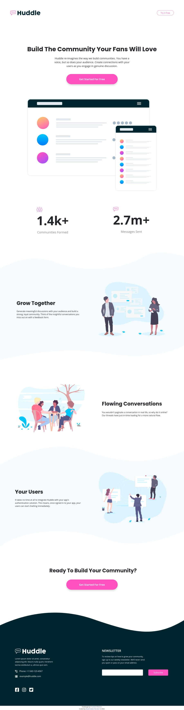

# Frontend Mentor - Huddle landing page with curved sections solution

This is a solution to the [Huddle landing page with curved sections challenge on Frontend Mentor](https://www.frontendmentor.io/challenges/huddle-landing-page-with-curved-sections-5ca5ecd01e82137ec91a50f2). Frontend Mentor challenges help you improve your coding skills by building realistic projects.

## The challenge

Your challenge is to build out this landing page and get it looking as close to the design as possible.

You can use any tools you like to help you complete the challenge. So if you've got something you'd like to practice, feel free to give it a go.

Your users should be able to:

-   View the optimal layout for the site depending on their device's screen size
-   See hover states for all interactive elements on the page

## Screenshot

## Links

-   Solution URL: [Frontend Mentor solution](https://www.frontendmentor.io/solutions/mobile-first-html5-css3-bootstrap4-KDTcVFt6Y)
-   Live Site URL: [Deployed on Github Pages](https://arpadgbondor.github.io/Web_challenge_3-Frontend_Mentor-Huddle_landing_page_with_curved_sections/)

## Built with

-   HTML5
-   CSS3
-   Bootstrap4
-   Mobile-first workflow

## Author

-   Github - [Arpad G. Bondor](https://github.com/ArpadGBondor)
-   Frontend Mentor - [Arpad G. Bondor](https://www.frontendmentor.io/profile/ArpadGBondor)
